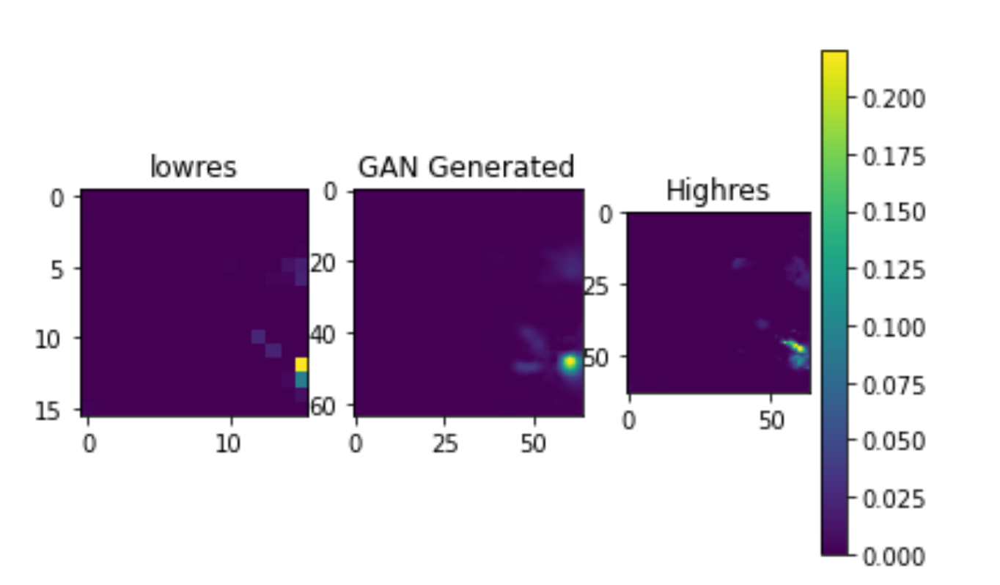

# GeospatialSRGAN
Super Resolution GAN for geospatial precipitation data.

A super resolution GAN based approach for converting low res precipitation data(for south asia region) to its high res equivalent. The low res data is 16*16 and the high res data is 64*64. For evaluating the performance of the SRGAN model, PSNR and SSIM were used

**Results**

